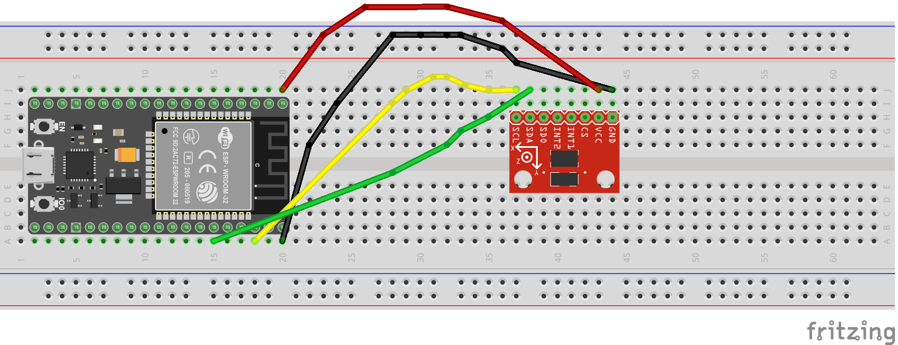
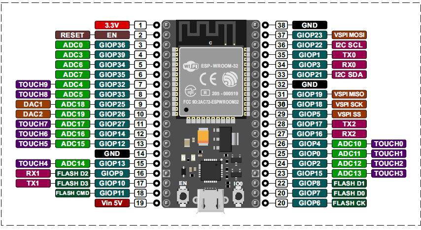
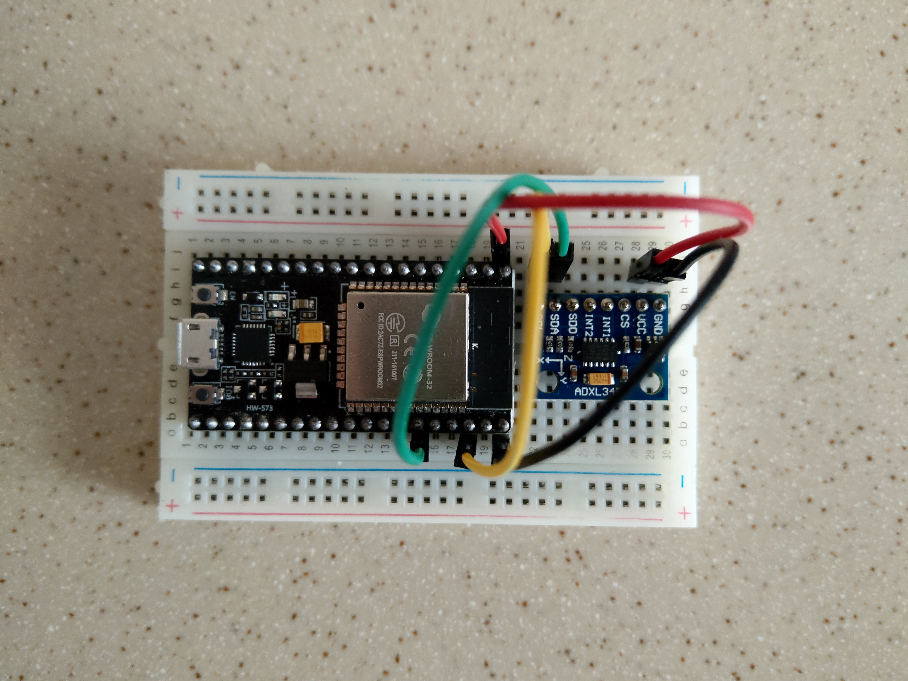
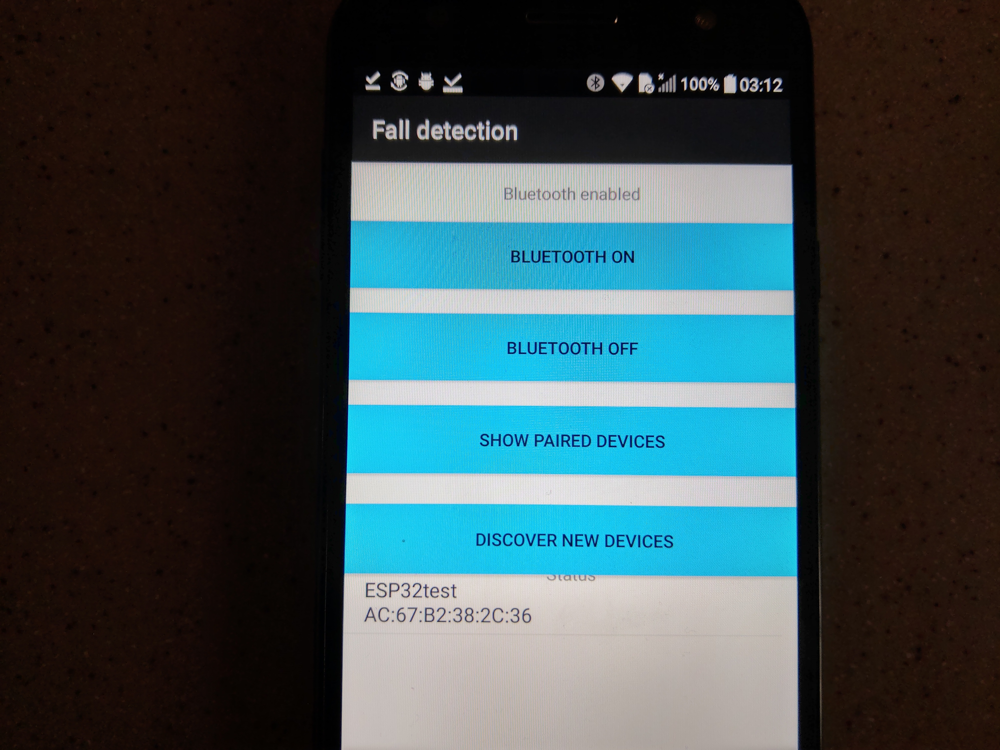

### Fall detection sensor that alerts an app which sends an SMS to close contacts and/or medical help.
### ❄ What it does
Uses an accelerometer to detect a fall and send a ping using serial blue tooth communication to an Android app that on receiving the ping sends a SOS message to emergency contacts.

🌀 Build and run : 
------------------
This project requires an ESP32 development board and an Android Phone.
> 1. Build the application by running `./gradlew clean build` command. Afterwards you can find in the build/output folder the artifact : `app-debug.apk`. You need to copy it to an Android based phone and install it.
> 2. In Sketch folder you'll find `fall_detection.ino` file which contains the code that needs to be uploaded using Arduino IDE to the ESP32 development board.

Components:
------------------
* ESP32: Development board which comes with Wi-Fi, Bluetooth Low Energy and Bluetooth Classic
* ADXL345 sensor: The ADXL345 is a small, thin, low power, 3-axis accelerometer with high resolution (13-bit) measurement at up to ±16g 

Technical Details:
------------------
* Bluetooth : The App implements RFCOMM connection to the well-known SPP UUID 00001101-0000-1000-8000-00805F9B34FB

🌀 ESP32 and ADXL345 sensor : 
-----------------------------------------------------------------------------------------------------------------------
In order to read accelerometer values from the ESP32 development board, we need to connect:
1. GND pin of ADXL345 to one of the GND pin on the ESP32 development board
2. 3v3 pin of ADXL345 to one of the 3v3 pin on the ESP32 development board
3. SDA pin of ADXL345 to GPIO21 on the ESP32 development board
4. SCL pin of ADXL345 to GPIO22 pin on the ESP32 development board

### 💎  Schematics

### 💎  ESP32 Board

### 💎  Pictures

